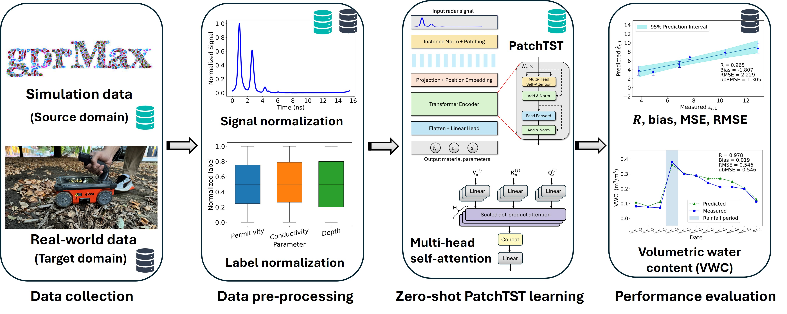

# Time-Series Transformers for Zero-Shot GPR-Based Subsurface Material Characterization

This repository provides the source code and experimental data
associated with the manuscript **"Time-Series Transformers for Zero-Shot
GPR-Based Subsurface Material Characterization."**

The study investigates the zero-shot generalization of time-series
Transformer models for ground-penetrating radar (GPR)-based subsurface
material characterization. The proposed PatchTST model is trained
exclusively on synthetic GPR data and directly applied to real-world GPR
measurements without using real-world data during model training.

## Framework Overview

The framework consists of four main stages:

1.  **Data collection:** Synthetic GPR signals are generated using
    gprMax, and real-world GPR measurements are collected from
    laboratory and field experiments.
2.  **Data preprocessing:** GPR signals and corresponding
    material-property labels are normalized before model training and
    evaluation.
3.  **Zero-shot PatchTST learning:** PatchTST is trained exclusively on
    synthetic GPR data to estimate subsurface material parameters, including
    relative permittivity, electrical conductivity, and layer depth.
5. **Performance evaluation:** The trained model is directly evaluated using
    real-world GPR measurements to assess its zero-shot generalization capability
    based on the correlation coefficient ($R$), bias, mean squared error (MSE),
    root mean squared error (RMSE), and unbiased root mean squared error (ubRMSE).

## Repository Contents

-   `DataGeneration.ipynb` — Synthetic GPR data generation using
    gprMax.
-   `CNN.ipynb` — 1D CNN baseline model.
-   `DANN.ipynb` — Domain-Adversarial Neural Network (DANN) baseline
    model.
-   `LSTM.ipynb` — LSTM baseline model.
-   `PatchTST.ipynb` — PatchTST training and evaluation workflow.
-   `PatchTST_Code/` — Source code for the PatchTST architecture and
    associated modules.
-   `1_layer_TEST_ExpData.xlsx` — Experimental GPR data for the
    laboratory single-layer material.
-   `Framework_Overview.jpg` — Overview of the proposed framework.

## Models

Four machine-learning models are provided:

-   **1D CNN:** Convolutional neural network baseline.
-   **DANN:** Domain-adaptation baseline trained using labeled synthetic
    source-domain data and unlabeled real target-domain data for
    adversarial domain alignment.
-   **LSTM:** Recurrent neural network baseline for GPR time-series
    modeling.
-   **PatchTST:** Transformer-based model trained exclusively on
    synthetic data for zero-shot transfer to real-world GPR
    measurements.

## Synthetic Data Generation

Synthetic GPR data are generated using the finite-difference time-domain
(FDTD) method implemented in **gprMax**. The data-generation code is
provided in `DataGeneration.ipynb`.

## Experimental Data

The repository includes experimental GPR data for the laboratory
single-layer material in `1_layer_TEST_ExpData.xlsx`. These data can be
used to evaluate model performance on real-world GPR measurements.

## Requirements

The code is implemented in Python. Major dependencies include:

-   PyTorch
-   NumPy
-   pandas
-   scikit-learn
-   Matplotlib
-   gprMax

Additional dependencies may be required by individual notebooks or
PatchTST modules.

## Usage

The notebooks provide the main workflows for synthetic data generation,
model training, and model evaluation. Users should update local file
paths in the notebooks as needed before execution.

## Citation

If you use the code or data in this repository, please cite:

**Z. Wang, I. Aziz, and M. Alipour, "Time-Series Transformers for
Zero-Shot GPR-Based Subsurface Material Characterization."**

Full bibliographic information will be added upon publication.

## Contact

**Zixin Wang, Ph.D.**  
Postdoctoral Research Associate  
Department of Civil and Environmental Engineering  
University of Illinois Urbana-Champaign  
Email: [zixinw@illinois.edu](mailto:zixinw@illinois.edu)  
Web: [https://zixinwang.web.illinois.edu/](https://zixinwang.web.illinois.edu/)
